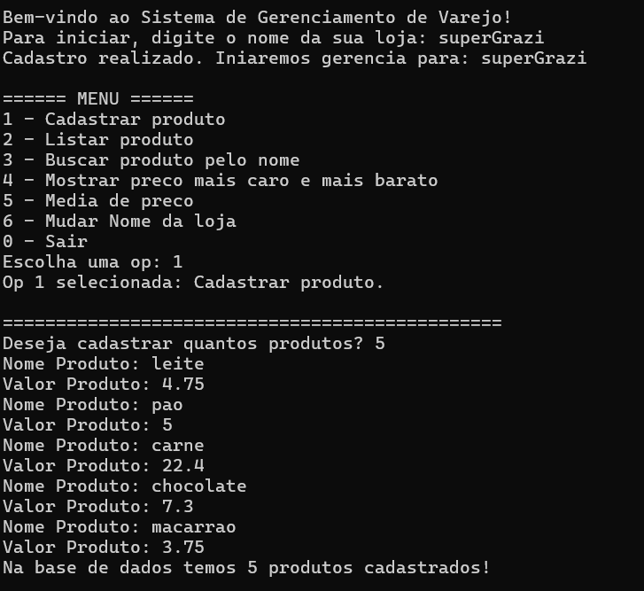
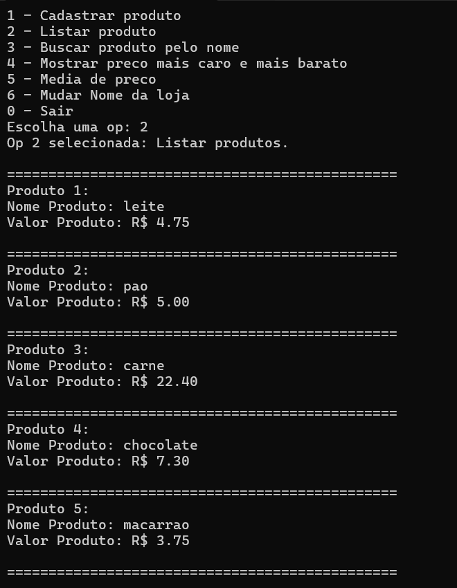
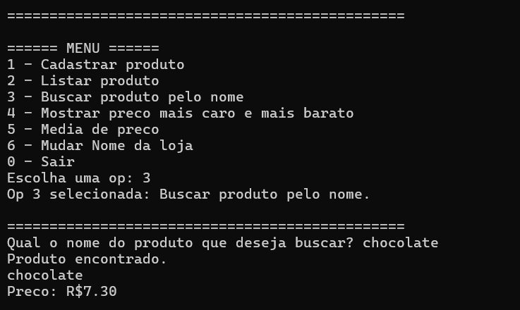

# Sistema de Gerenciamento de Varejo

Este projeto é um sistema simples em linguagem C para gerenciamento de produtos em uma loja. Ele permite cadastrar, listar, buscar e analisar produtos com base em seus preços.

## Funcionalidades

*   Cadastro de produtos
*   Listagem de produtos cadastrados
*   Busca de produto pelo nome
*   Exibição do produto mais caro e mais barato
*   Cálculo da média de preços
*   Alteração do nome da loja

## Imagens Demonstrativas

.
.
.

## Observações

*   O sistema suporta até **100 produtos**.
*   O nome da loja pode ser alterado durante a execução.
*   Nao suporta nome com espacos, por exemplo se quiser mercado jm use mercado_jm ou mercadoJM

